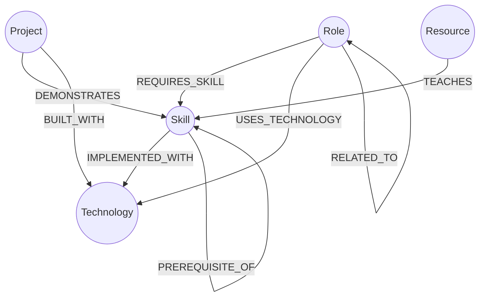

# SkillGraph — Career Intelligence Explorer

## Overview

SkillGraph is a premium, developer-focused career intelligence interface designed to visualize and explore the intricate relationships between career roles, technical skills, tools, technologies, and demonstrating projects. Backed by a powerful graph database, it provides intelligent insights into career paths, skill overlaps, and progressive learning prerequisites.

## Problem Statement

Navigating a career in technology is rarely a linear path. Traditional career navigation tools typically rely on relational databases to list roles and skills, leading to flat hierarchies that obscure the interconnected nature of the industry. It's difficult for a developer to understand multi-hop relationships such as:
- How does learning a specific foundational language unlock opportunities in multiple distinct career paths?
- What are the step-by-step prerequisite chains required to master an advanced technology?
- Which roles share the highest degree of overlapping technical knowledge for a potential career pivot?

SkillGraph solves this by mapping the tech industry as a connected ecosystem.

## Why a Graph Database?

A graph database (CognoDB/Neo4j) is uniquely suited for mapping career intelligence because the domain is inherently relationship-centric. Attempting this with a traditional relational schema would require expensive and awkward recursive `JOIN`s.

Concrete examples enabled by the graph structure in this application:
* **Variable-depth prerequisites:** Querying `(s:Skill)-[:PREREQUISITE_OF*1..4]->(advanced:Skill)` effortlessly traverses prerequisite learning chains regardless of depth. In SQL, this requires clumsy Recursive CTEs.
* **Shared skills between roles:** Finding `(Role A)-[:REQUIRES_SKILL]->(Skill)<-[:REQUIRES_SKILL]-(Role B)` is a natural pattern-matching operation instead of intersecting junction tables.
* **Multi-hop traversal:** Navigating `Role -> Skill -> Technology -> Project` involves scanning a continuous path across heterogenous node types, returning intuitive project recommendations based on career roles.
* **Role neighborhood exploration:** Recommending related roles based on skill overlap is executed via simple relationship-counting logic.

## Key Features

* **Role Explorer:** A discovery interface allowing users to browse, search, and filter roles by category with insightful metadata.
* **Role Detail:** Comprehensive breakdown of a role, organizing required skills by core/preferred/bonus importance, along with associated technologies and related adjacent roles.
* **Skill Ecosystem:** Deep-dives into individual skills, illuminating prerequisite chains, implementing technologies, demonstrating projects, and teaching resources.
* **Role Comparison:** Side-by-side analysis of two career roles showcasing overlapping shared skills and distinct, unique requirements.
* **Technology Explorer:** Ranks and explores technologies by their popularity and adoption across different roles in the database.
* **Interactive Graph:** A force-directed canvas visualization that allows users to seamlessly explore local subgraphs around a selected role.

## Architecture

The application adopts a robust, full-stack Next.js architecture separating presentation from data access.

```text
Browser 
  → Next.js App Router (React Server/Client Components)
    → Centralized Server-Side Query Layer (Q1-Q8)
      → Neo4j Official Driver (TCP Bolt Protocol)
        → CognoDB Graph Database
```

* **Server/Client Boundary:** Next.js Server Components securely handle the heavy lifting (executing Cypher queries directly via the driver) during render-time. Client Components are used sparingly and intentionally only where user interaction is necessary (e.g., Force Graph, Search Filtering, Mobile Menus).

## Graph Data Model



## Tech Stack

* **Frontend:** Next.js 16 (App Router), React 19, TypeScript
* **Styling:** CSS Modules / Vanilla CSS Design Tokens
* **Database:** CognoDB (Neo4j compatible)
* **Database Driver:** `neo4j-driver`
* **Validation:** Zod
* **Visualization:** `react-force-graph-2d`
* **Testing:** Jest, TypeScript Compiler (`tsc`)
* **Deployment:** Vercel

## Project Structure

```text
skillgraph/
├── src/
│   ├── app/                 # Next.js App Router routes
│   │   ├── api/             # Graph and API Route Handlers
│   │   ├── compare/         # Role comparison experience 
│   │   ├── explore/         # Technology explorer
│   │   ├── roles/           # Role detail pages
│   │   └── skills/          # Skill detail pages
│   ├── components/          # Reusable features (RoleCard, RoleGraph)
│   │   └── ui/              # Base UI components (Badge, Skeleton)
│   └── lib/
│       ├── neo4j.ts         # Singleton database connection
│       ├── queries.ts       # Centralized Cypher query logic
│       ├── schemas.ts       # Zod validation rules
│       └── types.ts         # Global TypeScript interfaces
├── scripts/
│   └── seed.ts              # CognoDB configuration and ingestion
└── docs/screenshots/        # Final application screenshots
```

## Getting Started

### Prerequisites
- Node.js 20+
- A valid Neo4j or CognoDB database instance.

### CognoDB Setup
1. Create a CognoDB account.
2. Create a free graph database instance.
3. Obtain the connection URI (e.g., `bolt+s://<hash>.databases.cognodb.cloud`).
4. Save the username (usually `cognodb`).
5. Save the generated password securely.
6. Create an `.env.local` file at the root of the project.

### Environment Variables
Create `.env.local` with the following variables:

```env
COGNODB_URI=bolt+s://your-instance.databases.cognodb.cloud
COGNODB_USER=cognodb
COGNODB_PASSWORD=your_secure_password
```
*Note: Ensure `.env.local` is never committed. It is properly ignored by Git.*

### Installation
Install the project dependencies:

```bash
npm install
```

### Seed Database
Populate the database using the provided script. This script establishes layout constraints and creates Nodes/Relationships defining the tech career ecosystem.

```bash
npx tsx scripts/seed.ts
```

### Run Locally
Start the development server:

```bash
npm run dev
```
Open [http://localhost:3000](http://localhost:3000) to view the application in the browser.

## Database Queries

All user-facing parameters are defensively bound to Cypher Queries parameterized via the official driver—preventing injection completely. Below are the key system queries:

### Q1: Role Discovery
Retrieves all top-level roles accompanied by a count of associated skills:
```cypher
MATCH (r:Role)
OPTIONAL MATCH (r)-[:REQUIRES_SKILL]->(s:Skill)
RETURN r, count(s) AS skillCount
```

### Q2: Role Detail Unpacking
Extracts role details alongside skills (including importance weights) and technology (including frequency):
```cypher
MATCH (r:Role {slug: $slug})
OPTIONAL MATCH (r)-[rs:REQUIRES_SKILL]->(s:Skill)
OPTIONAL MATCH (r)-[ut:USES_TECHNOLOGY]->(t:Technology)
RETURN r, collect({skill: s, importance: rs.importance}), ...
```

### Q3: Multi-Hop Exploration
Extracts highly structured multi-hop traversal demonstrating paths from Roles directly to practical Projects:
```cypher
MATCH (r:Role {slug: $slug})-[:REQUIRES_SKILL]->(s:Skill)-[:IMPLEMENTED_WITH]->(t:Technology)<-[:BUILT_WITH]-(p:Project)
RETURN s.name, t.name, collect(DISTINCT p.name)
```

### Q4: Cross-Role Overlap Comparison
Identifies intersecting skill arrays required by two distinct career identities:
```cypher
MATCH (r1:Role {slug: $slug1})-[:REQUIRES_SKILL]->(s:Skill)<-[:REQUIRES_SKILL]-(r2:Role {slug: $slug2})
RETURN s.name, s.category
```

### Q5: Related Role Proximity
Calculates closely matching career pivots mapped dynamically by overlapping target skills:
```cypher
MATCH (r:Role {slug: $slug})-[:REQUIRES_SKILL]->(s:Skill)<-[:REQUIRES_SKILL]-(related:Role)
RETURN related.name, count(s) AS sharedSkills
ORDER BY sharedSkills DESC
```

### Q6: Variable-Depth Prerequisite Chains
Traverses graph trees unearthing linear prerequisites spanning undetermined depths (1-4 links):
```cypher
MATCH path = (s:Skill {slug: $slug})-[:PREREQUISITE_OF*1..4]->(advanced:Skill)
RETURN [n IN nodes(path) | n.name]
```

### Q7: Visual Graph Subgraph
Grabs bounded localized structures (Nodes and Edges) projecting visual networks in the UI:
```cypher
MATCH (r:Role {slug: $slug})-[rel1]-(connected)
OPTIONAL MATCH (connected)-[rel2]-(secondary)
WHERE secondary <> r
RETURN r, connected, secondary, rel1, rel2
LIMIT $limit
```

### Q8: Technology Market Dominance
Extracts heavily-adopted technologies based strictly on frequency scaling across roles:
```cypher
MATCH (t:Technology)<-[:USES_TECHNOLOGY]-(r:Role)
RETURN t.name, count(r) AS roleCount
```

## Screenshots

*(Ensure screenshots are uploaded to `docs/screenshots/`)*
- `landing-page.png`
- `role-detail.png`
- `interactive-graph.png`
- `skill-detail.png`
- `role-comparison.png`
- `technology-explorer.png`

## Live Demo

[SkillGraph Vercel Deployment](#) *(Replace with URL post-deployment)*

## Testing

Ensure code meets organizational testing, typings, and linting constraints efficiently:

```bash
# Execute Jest coverage
npm test

# Affirm Typescript Type Checking
npx tsc --noEmit

# Trigger Production compilation build
npm run build
```
Unit testing comprehensively monitors JSON graph transformations, URL parameters parsing, and data type boundaries.

## Performance / Accessibility

- **Performance**: High reliance on Server Components drops arbitrary UI loading metrics. Graph structures leverage React client lazy-loading dynamically restricting Main Thread delays while retaining canvas fidelity across bounds.
- **Accessibility**: Built intentionally with WCAG constraints in mind (`:focus-visible` styling, rich HTML semantics). Due to Canvas element access limits, an elegant "Text-Alternative" view lists node contents automatically beneath graphical diagrams specifically for Screen Readers.

## Technical Decisions

* **Next.js App Router**: Employed for exceptional SEO capabilities, layout nesting flexibility, and best-in-class Server Component foundations matching external database connections.
* **Server Components**: Reduces bundle payloads. Prevents exposing sensitive `COGNODB` credentials directly to active user browsers.
* **Route Handlers (`/api`)**: Allows Next.js to provide standard REST endpoints driving client-invoked actions without demanding a dedicated backend monolith.
* **Neo4j Official Driver**: Highly robust, secure driver bridging Bolt TCP seamlessly into Node environments providing connection pooling natively.
* **`react-force-graph-2d`**: Lean visual engine projecting 2D node graphs dynamically utilizing robust d3-force positioning systems without dragging in D3 entirety manually.
* **Dynamic Rendering (`force-dynamic`)**: Explicitly configured across primary routes to accommodate the nature of evolving graph databases wherein rendering stale build-time static paths introduces reliability flaws and data fatigue during production pipelines.
* **No Global State (Zustand/Redux)**: Abandoned purposefully. Complexity handles beautifully via native `useSearchParams` URL parameter tracking allowing native deep linking without heavy hydration contexts.

## Limitations
* Product excludes active User Authentication integrations (Not required).
* Application maintains strict Read-Only perspectives on UI mapping (No CRUD interfaces for graph mapping available internally).
* Application omits specialized AI logic components.
* Technology mapping interactions within graphs intentionally do not route clicks towards undefined technology overview pages.

## Future Improvements
* Introduction of User Accounts supporting explicitly tracking individual career progressions against the larger graph layout.
* Graph Pathfinding API generating optimal step-by-step curricula maps scaling toward specific target roles.
* Advanced Admin interfaces exposing interactive mapping nodes utilizing direct Neo4j write injections.

## License
MIT License
